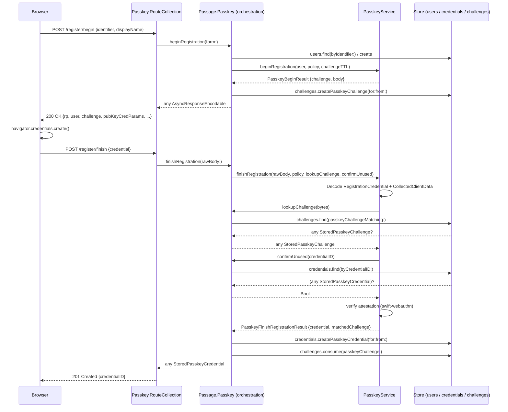

# Passkey

WebAuthn / FIDO2 passwordless authentication with phishing-resistant public-key credentials.

## Overview

The Passkey feature lets users register a public-key credential (passkey) bound to their device or sync fabric (iCloud Keychain, Google Password Manager, 1Password, etc.) and use it to prove identity to the server without a shared secret. Passage defines the storage protocols, orchestration, HTTP routes, and configuration surface; cryptographic verification is delegated to a pluggable `PasskeyService` implementation — see [passage-webauthn](https://github.com/rozd/passage-webauthn) for the default `swift-webauthn` backend.

**Key capabilities:**
- W3C WebAuthn Level 3 registration ceremony (begin → finish)
- W3C WebAuthn Level 3 authentication ceremony (begin → finish) — discoverable / usernameless flow
- Challenge storage with SHA-256 hashing + TTL + one-shot consumption (per-ceremony kind)
- Credential storage (public key, sign count, backup flags, transports) + sign-count updates on every successful authentication
- Session cookie + exchange code issued on successful authentication (same pattern as OAuth)
- Dual-mode response: JSON for API clients, HTML redirect for Leaf-backed form submissions
- Core package has **zero** dependency on any WebAuthn library — swap backends freely

## Implementation Status

| Capability | Status |
|------------|--------|
| Signup ceremony (begin + finish) — public, form-driven | ✅ Implemented |
| Register ceremony (begin + finish) — authenticated user adds a passkey | ✅ Implemented |
| Authentication ceremony (begin) | ✅ Implemented (discoverable-only) |
| Authentication ceremony (finish) | ✅ Implemented — sign-count update + session + exchange code |
| `WebAuthnPasskeyService` backend | ✅ Implemented in `passage-webauthn` (both ceremonies) |
| `PasskeyCredentialStore` / `PasskeyChallengeStore` protocols | ✅ Defined |
| In-memory store impls (for tests) | ✅ In `PassageOnlyForTest` |
| Fluent-backed store impls | ❌ Not yet in `passage-fluent` |
| Leaf view for signup | ✅ `passkey-signup-minimalism` template |
| Leaf view for authentication | ✅ `passkey-authenticate-minimalism` template |
| `allowDiscoverableLogin` policy flag | ✅ Enforced at `beginAuthentication` — when `false`, begin returns `400 discoverableLoginDisabled` |
| Hinted (username-first) authentication | ⚠️ Reserved at the protocol layer (`allowCredentials: [PasskeyCredentialDescriptor]?`) but orchestration is discoverable-only — no HTTP endpoint accepts a user hint |
| `allowAutoRegistration` linking flag | ⚠️ Reserved — discoverable flow without a stored credential currently returns `401 unknownPasskey`; auto-create-user-from-userHandle not implemented |
| AAGUID / attestation-format capture | ⚠️ Returned as `nil` — `swift-webauthn` doesn't expose these through its public surface |
| `uvInitialized` flag | ⚠️ Derived from `policy.userVerification == .required`, not read from authenticator data |

## Architecture

Passkey support is split across three packages to keep the cryptographic backend swappable:

```
passage/                     — abstraction
  - PasskeyService protocol (4 ceremony methods)
  - PasskeyCredential, PasskeyChallenge, PasskeyCredentialDescriptor (DTOs)
  - PasskeyCredentialStore, PasskeyChallengeStore (storage protocols)
  - Passage.Passkey feature (orchestration for both ceremonies)
  - Passkey.RouteCollection (4 HTTP routes)
  - Configuration.Passkey (config surface)

passage-webauthn/            — implementation
  - WebAuthnPasskeyService (wraps swift-webauthn)
  - Retroactive `AsyncResponseEncodable` for WebAuthn request + creation options
  - Mapping functions: WebAuthn.Credential → Passage.PasskeyCredential,
    WebAuthn.VerifiedAuthentication → Passage.PasskeyFinishAuthenticationResult

passage-fluent/              — storage (planned)
  - PasskeyCredentialModel, PasskeyChallengeModel (not yet implemented)
```

`passage` core imports only `Foundation` and `Vapor`. `passage-webauthn` is the only package that imports `WebAuthn` (from [swift-server/webauthn-swift](https://github.com/swift-server/webauthn-swift)).

## Configuration

```swift
Passage.Configuration(
    // ... other config ...
    passkey: .init(
        routes: .init(),                                // Default /auth/passkey/...
        policy: .init(
            timeout: .seconds(60),
            attestation: .none,
            userVerification: .preferred,
            supportedAlgorithms: [.ES256, .RS256]
        ),
        linking: .init(
            allowAutoRegistration: true                 // Reserved for auth ceremony
        ),
        challengeTTL: 300                               // 5 minutes
    )
)
```

Relying-party identity and allowed origins are configured on the `PasskeyService` implementation (e.g. `WebAuthnManager.Configuration`) at service init, not on `Configuration.Passkey`.

### Configuration Options

**`Configuration.Passkey`:**

| Option | Type | Default | Description |
|--------|------|---------|-------------|
| `routes` | `Routes` | `.init()` | Route path customization (see below). |
| `policy` | `Policy` | `.init()` | Per-ceremony WebAuthn knobs (see below). |
| `linking` | `Linking` | `.init()` | Post-authentication linking policy. |
| `challengeTTL` | `TimeInterval` | `300` | Challenge validity window, handed to the service per-call. |

**`Configuration.Passkey.Policy`:**

| Option | Type | Default | Used | Notes |
|--------|------|---------|------|-------|
| `userVerification` | `UserVerificationRequirement` | `.preferred` | ✅ | Forwarded to `requireUserVerification`. Also derives `uvInitialized` on the stored credential. |
| `supportedAlgorithms` | `[COSEAlgorithmIdentifier]` | `[.ES256, .RS256]` | ✅ | Forwarded as `publicKeyCredentialParameters`. |
| `attestation` | `AttestationConveyancePreference` | `.none` | ✅ | Forwarded to `attestation` parameter. |
| `timeout` | `Duration?` | `nil` | ✅ | Client-side ceremony timeout hint. |
| `allowDiscoverableLogin` | `Bool` | `true` | ✅ | Gate on `POST /authenticate/begin`. When `false`, the endpoint returns `400 discoverableLoginDisabled` — hinted/username-first auth is not exposed via any HTTP endpoint today. |

**`Configuration.Passkey.Routes`:**

| Option | Type | Default | Description |
|--------|------|---------|-------------|
| `group` | `[PathComponent]` | `["passkey"]` | Subpath under `Configuration.Routes.group` |
| `signupBegin.path` | `[PathComponent]` | `["signup", "begin"]` | Begin signup (public) |
| `signupFinish.path` | `[PathComponent]` | `["signup", "finish"]` | Finish signup (public) |
| `registerBegin.path` | `[PathComponent]` | `["register", "begin"]` | Begin register (authenticated) |
| `registerFinish.path` | `[PathComponent]` | `["register", "finish"]` | Finish register (authenticated) |
| `authenticateBegin.path` | `[PathComponent]` | `["authenticate", "begin"]` | Begin authentication endpoint |
| `authenticateFinish.path` | `[PathComponent]` | `["authenticate", "finish"]` | Finish authentication endpoint |

## Registration Ceremonies

Passage exposes two separate registration flows with distinct trust models:

### Signup (`POST /auth/passkey/signup/{begin,finish}`) — public

Public, form-driven flow for new users who want to create an account using a passkey as their primary credential. Identity is self-asserted via a form identifier (email / phone / username).

1. Client POSTs a `PasskeySignupForm` with one of `email` / `phone` / `username` plus `displayName`.
2. Orchestration resolves the identifier to a `User` (finding or creating via `UserStore`).
3. `PasskeyService.beginRegistration(with:policy:challengeTTL:)` produces a raw challenge plus an opaque creation-options body.
4. Core persists the challenge bound to the resolved user. The `PasskeyChallengeStore` SHA-256-hashes the raw bytes internally — plaintext never reaches the DB.
5. Response on `/begin`: `PublicKeyCredentialCreationOptions` JSON (`Accept: application/json`) or a redirect back to the configured `views.passkeySignup` Leaf view (form submission with `Accept: text/html`).
6. Browser calls `navigator.credentials.create()` and POSTs the result to `/signup/finish`.
7. Service verifies the attestation via `lookupChallenge` + `confirmUnused`; core persists the credential and consumes the challenge.
8. Response on `/finish`: `201 Created` with `PasskeyRegistrationResponse { credentialID }`.

### Register (`POST /auth/passkey/register/{begin,finish}`) — authenticated

Authenticated flow for users who already have an account (created via password, OAuth, magic-link, or a prior passkey) and want to add a new passkey. This is the FIDO / Apple / Google recommended default. Both endpoints are guarded by `PassageSessionAuthenticator` + `PassageBearerAuthenticator` — unauthenticated requests return `401`.

1. Client POSTs an optional `PasskeyRegisterRequest` body to `/register/begin` with `{ "displayName": "…" }` (or no body); the authenticated user is resolved via `request.auth`. Display name defaults to `user.username ?? user.email ?? user.phone ?? "Passkey"`.
2. Same challenge-issuance path as signup — the challenge is bound to the authenticated user.
3. Response on `/begin`: `PublicKeyCredentialCreationOptions` JSON. JSON only; no Leaf view.
4. Browser calls `navigator.credentials.create()` and POSTs to `/register/finish` with the same bearer/session.
5. Core recovers the user from the matched challenge and **asserts it equals the authenticated user** — a mismatch is rejected with `401 invalidPasskeyChallenge` as defense-in-depth against cross-session challenge swapping.
6. Core persists the credential and consumes the challenge.
7. Response on `/finish`: `201 Created` with `PasskeyRegistrationResponse { credentialID }`.

### Shared machinery

Both flows delegate to a private `beginRegistrationCore(for:userEntity:)` and `finishRegistrationCore(rawBody:authenticatedUser:)` in `Passage+Passkey.swift`. The `PasskeyService` protocol sees a single registration ceremony — the signup-vs-register distinction is an HTTP/orchestration concern, not a cryptographic one.

## Authentication Ceremony

**Discoverable-only.** The endpoint takes no user-supplied identifier — the authenticator reveals which credential the user picked, and the server recovers the user from that credential's stored record. A typed form would defeat the UX win of passkeys. When `policy.allowDiscoverableLogin` is `false` the begin endpoint returns `400 discoverableLoginDisabled`; hinted/username-first authentication is not exposed over HTTP today.

### Begin (`POST /auth/passkey/authenticate/begin`)

1. Browser POSTs an empty body (`{}` is fine; content-type is ignored).
2. Orchestration calls `PasskeyService.beginAuthentication(allowCredentials: nil, policy:, challengeTTL:)`.
3. The service returns raw challenge bytes plus an opaque `PublicKeyCredentialRequestOptions` body.
4. Core persists the challenge via `PasskeyChallengeStore.createPasskeyChallenge(for: nil, from:)` — `user == nil` because the picker hasn't chosen yet; the kind is `.authentication`.
5. Response: the WebAuthn `PublicKeyCredentialRequestOptions` JSON (`challenge`, `rpId`, `timeout`, `allowCredentials: null`, `userVerification`).

### Finish (`POST /auth/passkey/authenticate/finish`)

1. Browser POSTs the raw WebAuthn JSON (the result of `navigator.credentials.get()`).
2. Route handler reads the raw body and hands it to `PasskeyService.finishAuthentication(rawBody:policy:lookupChallenge:lookupCredential:)`.
3. Service decodes into the WebAuthn library's native `AuthenticationCredential`, extracts the challenge from `clientDataJSON`, and invokes `lookupChallenge` (which validates `kind == .authentication`, not consumed, not expired).
4. Service invokes `lookupCredential` to fetch the stored credential's public key + current sign count; throws `unknownPasskey` if no stored credential matches.
5. Service runs signature + sign-count verification via `swift-webauthn` and returns `PasskeyFinishAuthenticationResult { matchedCredential, matchedChallenge, newSignCount, credentialBackedUp, userHandle? }`.
6. Core calls `PasskeyCredentialStore.updatePasskeyCredentialAfterAuthentication(forCredentialID:newSignCount:isBackedUp:)`, consumes the challenge, and resolves `user` from `matchedCredential.user`.
7. Core calls `request.passage.login(user)` (sets session cookie if sessions are enabled) and mints an exchange code via `request.tokens.createExchangeCode(for: user)`.
8. Response: `200 OK` with `PasskeyAuthenticationResponse { code }`. The browser-side JS typically redirects to the view's `redirect.onSuccess` with the code appended as `?code=...`, matching the OAuth exchange-code pattern.

## Routes & Endpoints

| Method | Path | Auth | Description |
|--------|------|------|-------------|
| GET  | `/auth/passkey/signup/begin` | public | Renders the Leaf form (only when `views.passkeySignup` is configured) |
| POST | `/auth/passkey/signup/begin` | public | Begins signup ceremony (form-driven) |
| POST | `/auth/passkey/signup/finish` | public | Finalizes signup ceremony |
| POST | `/auth/passkey/register/begin` | session/bearer | Begins register ceremony (authenticated user adds a passkey) |
| POST | `/auth/passkey/register/finish` | session/bearer | Finalizes register ceremony — asserts session user matches challenge user |
| GET  | `/auth/passkey/authenticate/begin` | public | Renders the Leaf form (only when `views.passkeyAuthenticate` is configured) |
| POST | `/auth/passkey/authenticate/begin` | public | Begins authentication ceremony (discoverable) |
| POST | `/auth/passkey/authenticate/finish` | public | Finalizes authentication ceremony, issues session + exchange code |

All paths honor `Configuration.Passkey.Routes` overrides.

## Flow Diagrams

### Registration



### Authentication

```mermaid
sequenceDiagram
    participant Browser
    participant Routes as Passkey.RouteCollection
    participant Orch as Passage.Passkey (orchestration)
    participant Svc as PasskeyService
    participant Store as Store (credentials / challenges / tokens)
    participant Session as Passage.login + tokens

    Browser->>Routes: POST /authenticate/begin {} (empty)
    Routes->>Orch: beginAuthentication()
    Orch->>Svc: beginAuthentication(allowCredentials: nil, policy, challengeTTL)
    Svc-->>Orch: PasskeyBeginResult {challenge, body}
    Orch->>Store: challenges.createPasskeyChallenge(for: nil, from:)
    Orch-->>Routes: any AsyncResponseEncodable
    Routes-->>Browser: 200 OK {challenge, rpId, timeout, userVerification}

    Browser->>Browser: navigator.credentials.get()

    Browser->>Routes: POST /authenticate/finish {assertion}
    Routes->>Orch: finishAuthentication(rawBody:)
    Orch->>Svc: finishAuthentication(rawBody, policy, lookupChallenge, lookupCredential)
    Svc->>Svc: Decode AuthenticationCredential + CollectedClientData
    Svc->>Orch: lookupChallenge(bytes)
    Orch->>Store: challenges.find(passkeyChallengeMatching:) (kind == .authentication)
    Store-->>Orch: any StoredPasskeyChallenge?
    Orch-->>Svc: any StoredPasskeyChallenge
    Svc->>Orch: lookupCredential(credentialID)
    Orch->>Store: credentials.find(byCredentialID:)
    Store-->>Orch: any StoredPasskeyCredential?
    Orch-->>Svc: any StoredPasskeyCredential
    Svc->>Svc: verify signature + sign-count (swift-webauthn)
    Svc-->>Orch: PasskeyFinishAuthenticationResult {matchedCredential, newSignCount, credentialBackedUp, userHandle?}
    Orch->>Store: credentials.updatePasskeyCredentialAfterAuthentication(credentialID, newSignCount, isBackedUp)
    Orch->>Store: challenges.consume(passkeyChallenge:)
    Orch->>Session: request.passage.login(user)
    Orch->>Session: request.tokens.createExchangeCode(for: user)
    Session-->>Orch: String (opaque exchange code)
    Orch-->>Routes: (user, code)
    Routes-->>Browser: 200 OK {code} + Set-Cookie session
```



## Implementation Details

### `PasskeyService` Protocol

Cryptographic boundary. Implementations wrap a WebAuthn library (e.g. `swift-webauthn`):

```swift
protocol PasskeyService: Sendable {
    // Registration
    func beginRegistration(
        with user: PublicKeyCredentialUserEntity,
        policy: Passage.Configuration.Passkey.Policy,
        challengeTTL: TimeInterval
    ) async throws -> PasskeyBeginResult

    func finishRegistration(
        rawBody: Data,
        policy: Passage.Configuration.Passkey.Policy,
        lookupChallenge: @Sendable (_ challengeBytes: Data) async throws -> (any StoredPasskeyChallenge)?,
        confirmUnused: @Sendable (_ credentialID: String) async throws -> Bool
    ) async throws -> PasskeyFinishRegistrationResult

    // Authentication
    func beginAuthentication(
        allowCredentials: [PasskeyCredentialDescriptor]?,
        policy: Passage.Configuration.Passkey.Policy,
        challengeTTL: TimeInterval
    ) async throws -> PasskeyBeginResult

    func finishAuthentication(
        rawBody: Data,
        policy: Passage.Configuration.Passkey.Policy,
        lookupChallenge: @Sendable (_ challengeBytes: Data) async throws -> (any StoredPasskeyChallenge)?,
        lookupCredential: @Sendable (_ credentialID: String) async throws -> (any StoredPasskeyCredential)?
    ) async throws -> PasskeyFinishAuthenticationResult
}
```

Design notes:
- `PasskeyBeginResult.body` is `any AsyncResponseEncodable & Sendable` — the runtime value is whatever the WebAuthn library produces (e.g. `WebAuthn.PublicKeyCredentialCreationOptions` for registration, `WebAuthn.PublicKeyCredentialRequestOptions` for authentication). Core never names or inspects it.
- Both `finish*` methods take `rawBody: Data` rather than a typed DTO so core never has to model the WebAuthn ceremony JSON. The service owns decoding.
- `lookupChallenge` / `lookupCredential` / `confirmUnused` are closures rather than store references so core retains ownership of challenge + credential semantics (kind, expiry, consumed state, cross-ceremony rejection) while the service only decides *whether* the verification challenge matches something the server issued.
- `allowCredentials: [PasskeyCredentialDescriptor]?` on `beginAuthentication` is always `nil` from the current HTTP endpoint (discoverable flow). The parameter is preserved for forward-compatibility with a future hinted-flow API.

### DTOs

**`PasskeyChallenge`** — service → store boundary for a freshly issued challenge:

```swift
struct PasskeyChallenge {
    let bytes: Data                // raw challenge; store hashes before persisting
    let kind: PasskeyChallengeKind // .registration or .authentication
    let expiresAt: Date
}
```

**`PasskeyCredential`** — service → store boundary for a verified credential:

```swift
struct PasskeyCredential {
    let credentialID: String       // base64url
    let publicKey: Data            // COSE_Key bytes
    let signCount: UInt32
    let uvInitialized: Bool
    let transports: [AuthenticatorTransport]
    let backupEligible: Bool
    let isBackedUp: Bool
    let aaguid: String?            // nil on current swift-webauthn backend
    let attestationFormat: String? // nil on current swift-webauthn backend
}
```

**`PasskeyCredentialDescriptor`** — core → service hint for `allowCredentials` (reserved for hinted-flow auth; the HTTP layer always passes `nil` today):

```swift
struct PasskeyCredentialDescriptor {
    let credentialID: String              // base64url
    let transports: [AuthenticatorTransport]
}
```

**`PasskeyFinishAuthenticationResult`** — service → core return for the authentication ceremony:

```swift
struct PasskeyFinishAuthenticationResult {
    let matchedCredential: any StoredPasskeyCredential
    let matchedChallenge: any StoredPasskeyChallenge
    let newSignCount: UInt32
    let credentialBackedUp: Bool
    let userHandle: Data?           // populated when the authenticator returned one
}
```

**`PasskeyAuthenticationResponse`** — response body for `POST /authenticate/finish`:

```swift
struct PasskeyAuthenticationResponse: Content {
    let code: String                // opaque exchange code
}
```

### Storage Protocols

**`PasskeyCredentialStore`:**

| Method | Purpose |
|--------|---------|
| `createPasskeyCredential(for:from:)` | Persist a newly-registered credential |
| `find(byCredentialID:)` | Lookup by W3C `id` — used during authentication and the uniqueness check |
| `listPasskeyCredentials(forUser:)` | Device-management UIs |
| `updatePasskeyCredentialAfterAuthentication(forCredentialID:newSignCount:isBackedUp:)` | Post-auth sign-count / backup updates |
| `deletePasskeyCredential(byCredentialID:)` | User-initiated device removal |

**`PasskeyChallengeStore`:**

| Method | Purpose |
|--------|---------|
| `createPasskeyChallenge(for:from:)` | Persist a challenge; implementation SHA-256-hashes `bytes` internally |
| `find(passkeyChallengeMatching:)` | Look up by the raw bytes the authenticator echoed back |
| `consume(passkeyChallenge:)` | One-shot consumption |
| `cleanupExpiredPasskeyChallenges(before:)` | Maintenance |

Both store protocols are **optional** on `Passage.Store` — third-party conformances default them to `nil`. Passage's orchestration throws `PassageError.passkeyNotConfigured` if they're unset.

### Stored Record Protocols

Database backends conform to `StoredPasskeyCredential` and `StoredPasskeyChallenge` (generic over the backend's natural `Id` and `User` types). Each flattens the DTO fields plus `id`, `user`, `createdAt` / `updatedAt`. See `Sources/Passage/Protocols/StoredPasskeyCredential.swift` and `StoredPasskeyChallenge.swift`.

### WebAuthn Implementation

For the WebAuthn backend, use [passage-webauthn](https://github.com/rozd/passage-webauthn), which wraps [swift-webauthn](https://github.com/swift-server/webauthn-swift) 1.0.0-beta.1:

```swift
import PassageWebAuthn
import WebAuthn

let passkeyService = WebAuthnPasskeyService(
    configuration: WebAuthnManager.Configuration(
        relyingPartyID: "example.com",
        relyingPartyName: "My App",
        relyingPartyOrigin: "https://example.com"
    )
)

try await app.passage.configure(
    services: .init(
        store: store,
        passkey: passkeyService,
    ),
    configuration: .init(
        // ... other config ...
        passkey: .init()
    )
)
```

Core never imports `WebAuthn`. The `@retroactive AsyncResponseEncodable` conformance lives entirely in `passage-webauthn/Passage+WebAuthn.swift`.

### Views

Leaf-backed UI is opt-in per ceremony (signup and authenticate). The authenticated "register" flow is JSON only — no Leaf view.

```swift
views: .init(
    passkeySignup: .init(
        style: .minimalism,
        theme: .init(colors: .defaultLight),
        identifier: .email
    ),
    passkeyAuthenticate: .init(
        style: .minimalism,
        theme: .init(colors: .defaultLight),
        redirect: .init(onSuccess: "/")          // navigated to with ?code=... appended on success
    )
)
```

**Signup view** — When `passkeySignup` is configured, `GET /auth/passkey/signup/begin` renders `passkey-signup-minimalism.leaf` with inline JavaScript that collects the identifier + display name, calls `navigator.credentials.create()`, and POSTs to the finish endpoint. HTML form submissions to the begin endpoint redirect back to the view with `?success=` or `?error=` query parameters.

**Authentication view** — When `passkeyAuthenticate` is configured, `GET /auth/passkey/authenticate/begin` renders `passkey-authenticate-minimalism.leaf`. The form posts **no identifier** — the page fires `navigator.credentials.get({publicKey: options})` with the options returned by `POST /authenticate/begin` (empty body) and then POSTs the assertion to `/authenticate/finish`. On success, the JS navigates to `view.redirect.onSuccess` with the returned `code` appended as `?code=...` (matching the OAuth exchange-code handoff pattern). If `redirect.onSuccess` is not set, the page shows an inline success message.

Without a configured view, the GET route returns 404 while the POST ceremony endpoints keep working for JS-driven SPA clients.

## Error Handling

| Error | Trigger |
|-------|---------|
| `PassageError.passkeyNotConfigured` | `configuration.passkey` is nil, or `Store.passkeyCredentials` / `Store.passkeyChallenges` returns nil |
| `PassageError.passkeyServiceNotAvailable` | No `PasskeyService` registered in services |
| `AuthenticationError.invalidPasskeyChallenge` | Challenge lookup failed, expired, already consumed, wrong kind, or the service could not extract challenge bytes from `clientDataJSON` → `401` |
| `AuthenticationError.unknownPasskey` | Authentication finish: the posted credential ID does not match any record in `PasskeyCredentialStore` → `401` |
| `AuthenticationError.discoverableLoginDisabled` | `POST /authenticate/begin` when `policy.allowDiscoverableLogin == false`. No hinted-flow endpoint exists to fall back to → `400` |

## Related Features

- [Account](../Account/README.md) — Password-based authentication (alternative primary credential)
- [Passwordless](../Passwordless/README.md) — Magic-link authentication (alternative passwordless flow)
- [Tokens](../Tokens/README.md) — Access and refresh tokens issued after authentication
- [Views](../Views/README.md) — UI framework the passkey registration view plugs into
